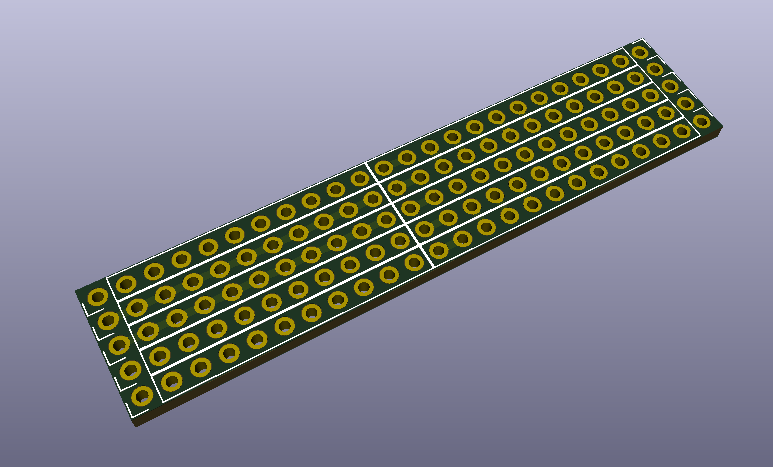

====================================================================================================================================================
Tarjeta de conexiones externas para RAK811/ RAK4200 LoRa adaptable nodes, de dimensiones reducidas para uso cuando ambos soportes de bateria AA se encuentran instalados 
====================================================================================================================================================

Tarjeta de conexiones externas & area de prototipado para montar algunos pocos ( y pequeños!) componentes thru-hole a un nodo LoRa. Tambien puede ser usada como plantilla para crear una tarjeta personalizada.

Lea esto en otros idiomas: `English <../README.rst>`_

Caracteristicas claves:
-----------------------
* Pistas y pads en doble cara para mayor durabilidad.
* Area de prototipado con 2 pistas paralelas que conectan varios pads, para ser usado como rieles de alimentacion y tierra..
* Solde directamente al pcb del nodo usando pines macho para una conexion permanente, rigida y de poca algura.
* Conecte a la pcb del nodo usando un conjuto de conectores de pines macho y hembra para una solucion mas flexible.

Como usar este repositorio
--------------------------
El circuito impreso fue desarrollado en KiCad V5.1.

Estructura de directorios
-------------------
* El directorio raiz contiene los archivos de KiCad: proyecto, esquematico y circuito impreso.
* gerber/single contiene los archivos para fabricacion del circuito impreso, para una sola tarjeta.
* gerber/panel_100mmx100mm contiene los archivos para fabricacion del circuito impreso, para multiples tarjetas que caben en un panel de 100mm x 100mm (usando Vcuts!).

Licencia
-------

.. image:: https://i.creativecommons.org/l/by/4.0/88x31.png
   :target: http://creativecommons.org/licenses/by/4.0/

Este es un proyecto de Hardware Libre y esta licenciado bajo una licencia `Creative Commons Attribution 4.0 International License, <http://creativecommons.org/licenses/by/4.0/>`_
